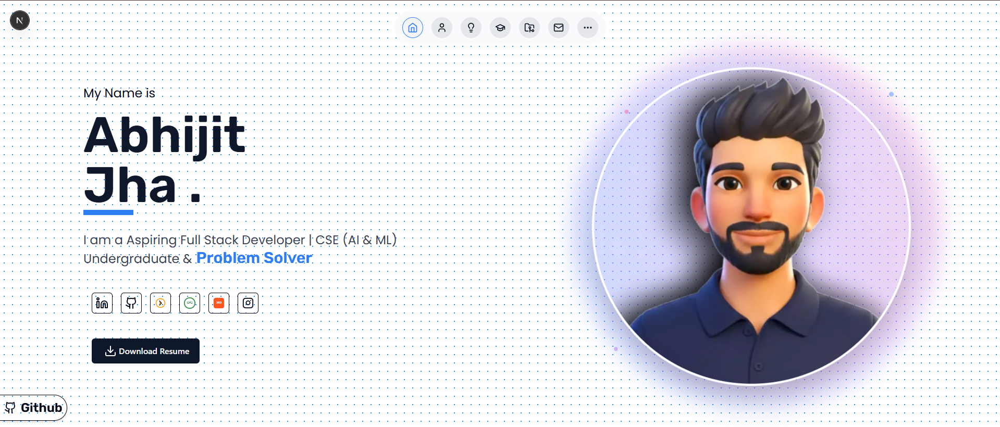

# 👋 Hi, I'm Abhijit Jha  

Aspiring **Full Stack Developer** | CSE (AI & ML) Undergraduate 🎓  

🚀 Passionate about building modern web apps with **Next.js, React, Tailwind, Shadcn UI, Node.js, and Spring Boot**.  
🌱 Currently exploring **AI & ML tools**.  
🎮 Gamer & Creator in my free time.  

---

## 🌐 Portfolio Preview  

  
*(Built with Next.js & Shadcn UI)*  

🔗 **Live Portfolio:** [Visit Here](https://abhijitjhaportfolio.vercel.app/)  

---

## 📬 Connect with Me  

  
  
  
  
  

  

---

## 🛠️ Tech Stack  

- **Frontend:** HTML5, CSS3, JavaScript, TypeScript, React, Next.js, TailwindCSS, Shadcn UI  
- **Backend:** Node.js, Express.js, Spring Boot  
- **Database:** MongoDB, MySQL, Redis  
- **Others:** Git, Firebase, REST APIs, AI/ML tools  

---

## 💼 Projects  

### 🔹 [QuickFix_HUB](https://github.com/abhijit1901/QuickFix_HUB)  
A MERN-based platform to simplify finding and booking trusted service providers for everyday home services.  
**Tags:** MongoDB, Express.js, React, Node.js  
🌐 [Live Demo](https://quickfix-hub-1.onrender.com/)  

---

### 🔹 [WEB--DEV-PROJECT-WANDERLUST](https://github.com/abhijit1901/WEB--DEV-PROJECT-WANDERLUST)  
A rental booking platform (inspired by Airbnb) built with EJS templates, server-side rendering, and custom booking flows.  
**Tags:** EJS, Node.js, Express.js  
🌐 [Live Demo](https://backend-h6p7.onrender.com/)  

---

### 🔹 [Enterprise-Grade Journaling API](https://github.com/abhijit1901/Enterprise-Grade-Journaling-API)  
A secure and scalable backend with JWT-based authentication, Spring Security, and Redis caching. Delivered RESTful APIs for user, journal, and weather data.  
**Tags:** Java, Spring Boot, Spring Web, Spring Security, MongoDB, Redis, JWT, Project Lombok, Maven  

---

### 🔹 [BLOGOPEDIA](https://github.com/abhijit1901/BLOGOPEDIA)  
A blogging engine built using EJS and JavaScript allowing authors to write and manage posts.  
**Tags:** EJS, MongoDB, Express.js, Node.js  

---

### 🔹 [Simon Say Game](https://github.com/abhijit1901/Simon_say-_game)  
A Simon-says style memory game implemented with JavaScript for interactive play and pattern recall.  
**Tags:** JavaScript, HTML, CSS  
🌐 [Play Here](https://abhijit1901.github.io/Simon_say-_game/)  

---

### 🔹 [Node MySQL User Manager](https://github.com/abhijit1901/node-mysql-user-manager)  
A backend user management system using Node.js and MySQL, featuring CRUD operations and authentication.  
**Tags:** Node.js, MySQL, Backend  

---

### 🔹 [Tic Tac Toe - Classic Game](https://github.com/abhijit1901/Tic-Tac-Toe)  
A simple yet interactive implementation of Tic Tac Toe where users can play against each other in the browser.  
**Tags:** JavaScript, HTML, CSS  
🌐 [Play Here](https://abhijit1901.github.io/tic-tac-toe-using-HTML-CSS-and-JAVASCRIPT/)  

---

### 🔹 [Spotify-inspired Music Player](https://github.com/abhijit1901/Spotify-clone)  
A visually stunning clone of the Spotify web player built using HTML, CSS, and Font Awesome for icons.  
**Tags:** HTML, CSS  
🌐 [Live Demo](https://abhijit1901.github.io/Spotify-clone/)  

---

## 📄 Resume  

📌 [Download Resume](./public/ABHIJIT_JHA_RESUME_UPDATED.pdf)  

---

## 🏆 Achievements  

- 📰 **[Published Research Paper](https://www.jisuniversity.ac.in/pdf/publish-paper/p124.pdf)** — *“Multimodal Web Design Automation: Structural Benchmarking and Content Generation with AI”* in JCSIR Journal (Vol. 1, Issue 2, Jan–June 2025).  
- 🥇 **[Best Paper Award](https://www.linkedin.com/feed/update/urn:li:activity:7343717650088267778/)** — for *“Multimodal Web Design Automation with AI”* at RAICCIT 2025.  
- 🔥 **[LeetCode](https://leetcode.com/u/Abhijit_Jha2003/)** — Solved **200+ DSA problems**.  
- 💡 **[GeeksforGeeks](https://www.geeksforgeeks.org/user/abhijitjrnaw/)** — Solved **100+ problems**.  
- ⚡ **[Code360](https://www.naukri.com/code360/profile/3a950343-09ea-44fa-9c90-995a3bd592a2)** — Solved **30+ problems**.  

